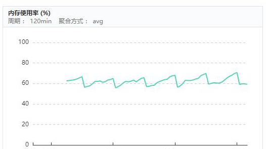

# 记一次rsync的io问题排查

#### 公司：HJSD
#### 职位：Java开发工程师
#### 项目代号：G

## 简介

G项目是在HJSD接触的第一个项目，项目中包含了数据采集的功能，主要的逻辑是，合作方在对接的时候，根据我方需求在指定地方埋点，然后定时产生对应的日志数据，我方定时通过rsync脚本获取到数据日志，并对日志进行分析清理，最后出统计报表。

## 问题说明

A商家是项目的合作方，在对接刚开始，程序功能一切正常，但随着A商家的业务快速扩展，后期定时统计数据便出现了问题，主要的现象是，定时统计的数据异常，次日发现排查数据文件发现并无异常，重新跑任务统计后数据正常，后期渐渐发展到上午排查时候发现异常，中午再次排查，发现数据正常。随后发现双方通过rsync进行同步数据时，同步的延迟越来越长，有时候甚至延迟了超过6个小时

## 解决过程

1、从前期程序的数据表现可以判定，后期的数据问题来由于统计时间点，对应数据尚未同步完

2、双方通过rsync进行日志数据的同步，随着A商家的扩展，已经发展到单天500W个日志的数据量，首先怀疑是由于日志文件数过多导致每次同步时长太长。但是，后期对比同等量级的商家，同样500W个日志，同样大小的日志，同等量级的商家并未有像A商家这样的高延迟

3、其次，怀疑双方网络问题，通过运维调取日志的监控日志，发现双方网络一直正常，带宽并无限制，也未达到最高点

4、rsync采取服务器客户端模式，怀疑由于服务器的CPU或者内存瓶颈导致服务器响应过慢。经过对比，服务器的内存和CPU并没有超出标准，同时通过对其他商家的对比，发现服务器的内存和CPU比同等量级的商家的配置要高，所以排除CPU和内存问题

5、最后考虑rsync同步属于IO密集型的操作，于是将问题锁定在磁盘IO上。

首先，通过iostat获取磁盘的IO状态。发现日志所在的盘使用率已经到达了100%，读写延迟都相当的高。

考虑可能是由于客户端的原因，导致的使用率过高，于是先暂停了客户端脚本的同步。随后，发现使用率仅降低了20%。随后与A商家的运维联系，通过了解，A商家是通过多客户端推送的方式来进行日志汇总的。于是，在将客户端推送关闭之后，磁盘的使用率恢复到正常状态。

6、总结问题所在，由于A商家采用客户端定时推送的方式，原本是每5分钟一次，随着不断发展，客户端越来越多，造成了磁盘的使用压力，导致我方客户端没法正常的获取到文件。在双方协商之后，A商家延迟客户端推送的周期，改为20分钟推送一次，同时错开推送时间，我方去除强制校验，减少rsync服务压力，最后问题得到了解决。

### 生产总结

rsync服务主要是用于提供高效的数据同步，在生产使用的过程中，随着数据量的增大，需要注意以下几点：

1、inodes数目数问题：通常作为rsync服务，大部分运维会考虑将磁盘容量扩大，来达到存取文件的效果。然而，除此之外，inodes文件数的限制，也会影响到文件的存取。即使数据大小没有超过磁盘限制，inodes也会影响到数据的存储。所以做rsync服务的时候，如果存储的文件数过多，需要注意inodes数目的监控，防止服务不可用

2、io问题：rsync同步的过程中，会对文件进行读写、校验等操作，加上文件数较多，此类操作数据IO密集型，需要注意服务调用的方式与频率，防止io负载过高

---

#### 点滴知识，源于思考
