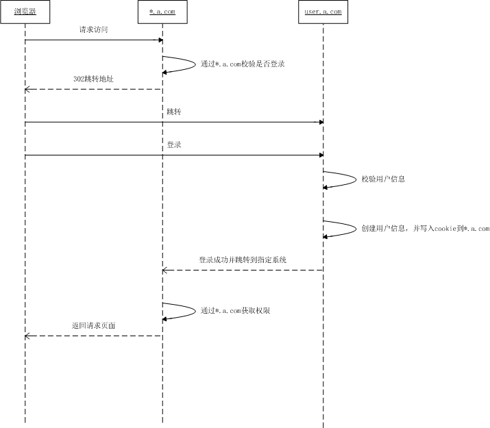

# 基于cookie的多系统登录

#### 公司：HJSD
#### 职位：Java开发工程师
#### 项目代号：G

## 简介

G项目是在HJSD接触的第一个项目，是一个年长且功能强大的业务项目，子系统10+个，包含了数据采集、任务调度、报表展示、业务管理等一系列的功能。各个子系统公用一套用户体系，用户一次注册/登录即可实现系统间的相互切换

## 分析

一个项目多个子系统，在项目进行到后期是比较常见的情况。解决多系统之间授权的方式也有很多，比如我们常见的使用cas的方式。而在这个项目中，可能由于比较年长的原因，它采用的是基于同域共享cookie的方式来进行多个系统之间的授权

### 实现前提

1. 使用同个域名下的子域名（可以细化到二级域名、三级域名）
2. 独立用户中心
3. 自定义严谨的cookie共享策略（加密策略、过期策略、获取策略）

### 基础逻辑

上图是一个简单的逻辑流程：

1. 用户首次请求的时候，各子系统进行第一轮的校验
2. 系统未能从*.a.com的域名下获取相关用户信息，进行页面跳转，将用户引导到用户中心的登录页面
3. 用户在登陆页面输入用户名密码进行登录请求
4. 用户中心校验用户信息，成功后将用户信息写入*.a.com这个域名的cookie下。此处需要对信息进行加密
5. 用户中心引导跳转返回原来请求的子系统
6. 子系统再次校验通过后，显示用户所需要请求的页面

### 思考

这种方式，其实依靠的是同域名cookie共享的方式，使得用户登录状态可以给多个子系统获取，早期许多系统采用的是这种方式，但这种方式却存在着局限性，所以后期有了更好的解决方案。局限性如下：

1. 同样的方式，在多个域名的情况就会存在问题了。
2. 这种方式在不同语言中不能通用，因为不同语言使用的cookie方案是不一样的
3. cookie存在安全性的问题，容易被cookie伪造实现系统登录（实操过^_^）

虽然说有局限，可是如果是用在内部系统，在设置白名单的情况下，这种方式不失为一种节省资源的多系统解决方案

如何解决cookie问题？

虽然cookie的安全性问题没法根治，但如果必要的措施可以让安全问题没那么高

1. 对cookie进行加密解密
2. 限制多系统之间授权的方式，即A系统要登录B系统，需要通过一个特殊的页面进行授权跳转才行，这个页面在系统内部，没法通过外部访问
3. 多个系统用多个加密授权的cookie，防止仅使用一个授权cookie
4. 对用户的最后访问路径进行监控，因为访问的路径修改的频率较高，进行cookie窃取没法窃取最新的（仅限参考）

最后，除了一些已经稳定运行，迭代了多次的老项目，还是采用更安全的方式吧

---

#### 点滴知识，源于思考

